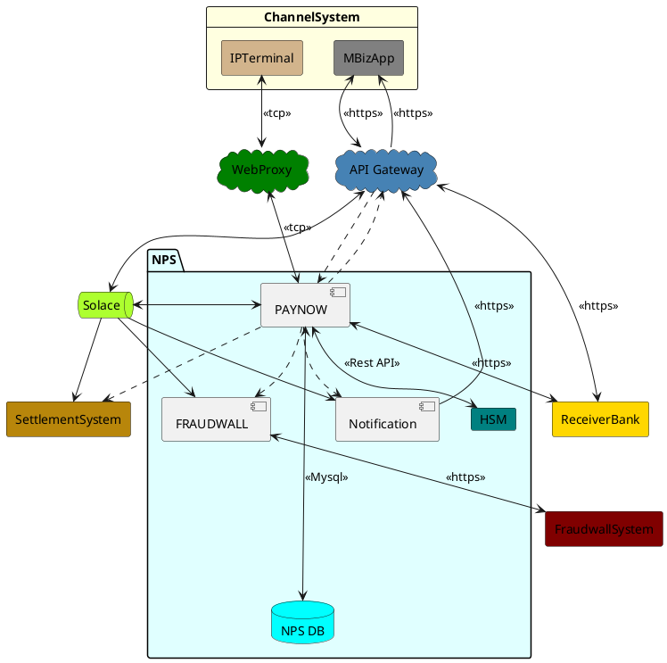
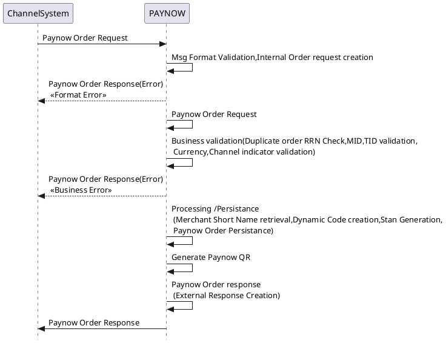
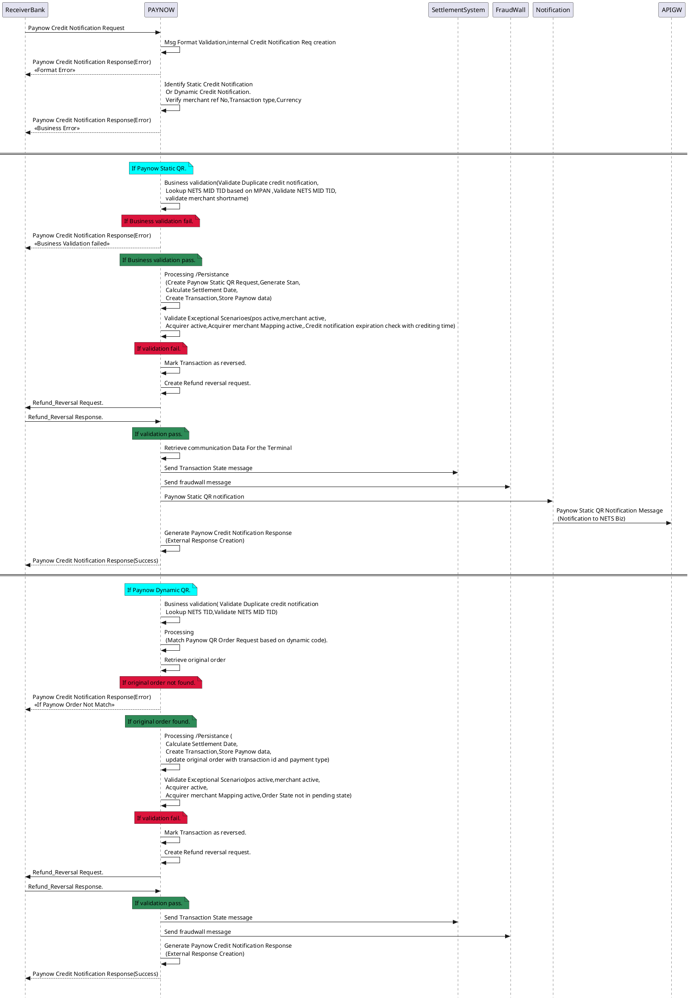
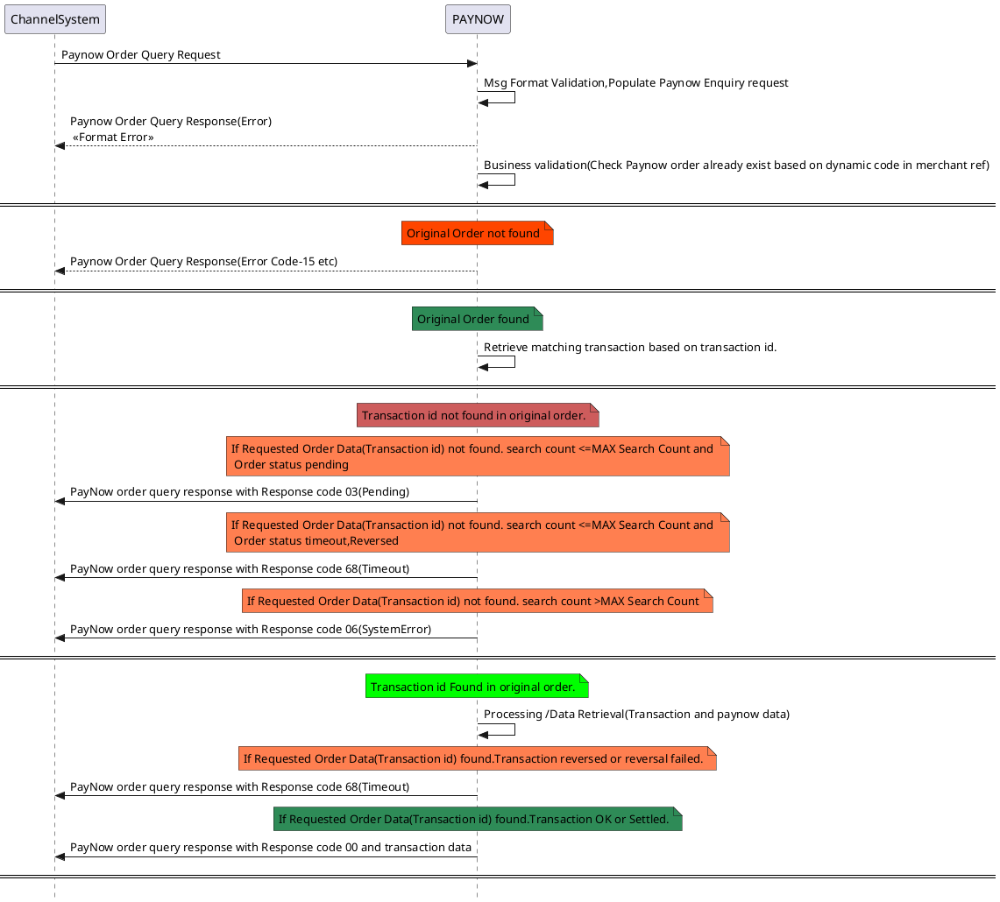
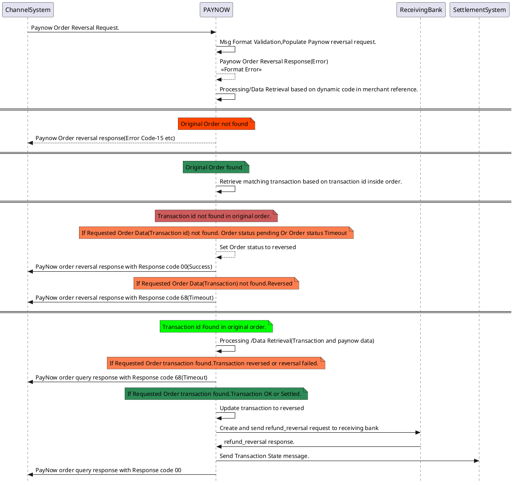

## NPS Paynow Technical Design
---
### Reference Documentation
>NETS QR Switch - Paynow Interface Specification v1.0.1-DRAFT.docx
>NPS Message Spec in JSON v2.4 - Final.

### Terminology and Convention
---
* APS – Alternate Payment Service
* NPS – New Payment System
* APIGW -API Gateway
* Paynow-Paynow process Processing Paynow QR transactions from receiver bank.Also It handle Order/Enquiry/Reversal requests from ChannelSystems.It send Payment notifications to Notification module and Transaction state messages to Settlement System.At the end of the day it recon transaction with Settlement system. 
* Solace - Solace is the message bus to communicate across nets subsystems and between NPS modules.
* Notification - Notification communicates with NETS Biz Merchants through APIGW
* ChannelSystem(IP Terminal) -Order Channel
* ChannelSystem(MBiz App)-StaticQR Merchant APP
* ReceiverBank -Source Of Fund
* SettlementSystem -Tandem Settling with Banks As NETS as a Master Acquirer
* FraudwallSystem -Fraud transaction detection.

### High Level System Architecture (NPS Transaction Flow)
---
Below diagrams gives an internal overview of different components of the system

<!-- High level System Diagram Start-->

<!-- High level System Diagram End-->

### MTI & Process Codes
---
| API                        | Request MTI | Request  Process Code | Response MTI | Response  Process Code |
|----------------------------|-------------|-----------------------|--------------|------------------------|
| Paynow Credit Notification | 8200        | 420000                | 8210         | 420000                 |
| Paynow Order               | 0200        | 995000                | 0210         | 995000                 |
| Paynow Order Query         | 0100        | 335000                | 0110         | 335000                 |
| Paynow Order Reversal      | 0400        | 995000                | 0410         | 995000                 |
| Refund Reversal            | 8400        | 440000                | 8410         | 440000                 |

### Sequence Diagrams
---

#####1.Paynow Order Request/Response
---

<!-- Paynow order Sequence Diagram Start-->

<!-- Paynow order Sequence Diagram End-->

#####2 .Paynow Credit Notification Request/Response
---
<!-- Paynow Credit notification Sequence Diagram Start-->

<!-- Paynow Credit notification Sequence Diagram End-->

##### 3.Paynow Order Query Request/Response
---
<!-- Paynow Order Query Sequence Diagram Start-->

<!-- Paynow Order Query Sequence Diagram End-->

##### 4.Paynow Order Reversal Request/Response

<!-- Paynow Order Reversal Sequence Diagram Start-->

### Queue and Topic Name
---
#### API Gateway to Inbound:

##### Paynow Credit Notification
Queue- Q.CPS.00.P101.REQ.JSON.SUB   
Topic- P101/G/A/SUB/REQ/TRX/APIGW01/PAY/PNCRDNOTIFY/NIL/V1/ANY/>

#### Transaction State Message

Solace Topic: P101/G/A/SUB/ANY/TRX/CPS/PAY/TXNSTATE/NIL/V1/JSON/{ transaction_type}/{institution_code}/{status}/{response_code}/{acquirer_institution_code}/{transaction_id}

transaction_type -> PNSTATICCN/PNDYNAMICCN/PNDYNAMICREVERSAL
institution_code -> 30000000033,30000000034,30000000035

#### Fraud wall message
Solace Topic:P101/G/A/LOC/RES/TRX/CPSPAYNOW/CPSFW/PAY/ANY/NIL/V1/JSON/1

### Paynow QR Formatting (QR String)
---
##### Merchant Reference Number:
###### Static PayNow QR: 
MPAN (16) + Type Indicator (1) + ShortName (8)
###### One-time use PayNow QR: 
Dynamic code (16) + Type Indicator (1) + ShortName (8)

##### Type Indicator (Proposed):
###### Static PayNow QR:
 Space (0x20h)
###### One-time use PayNow QR: 
 Hyphen (0x2Dh)
###### Switch model: 
 Period (0x2Eh)

### Paynow QR Formatting (QR Image)
---
250 px * 250 px

### Message Encryption and Signature
---
####OCBC
Digital signature
To consume OCBC transactional APIs,Bank has utilized the OAuth 2.0 authorization framework that allows third party applications to gain limited access in both time and scope to customer account details.
1.Authorization API
The access token returned from the Authorization Server will be used to:
• Distinguish between different our user session
• Validate user consent against requested permission
• Verify that user session has not expired
2.Transaction Refund API
This API allows merchants to refund the payer for double debit/dispute.

####DBS
RSA and AES Encryption and Decryption are to be implemented at Merchant and DBS while transmitting request and response.

At the time of merchant on-boarding at DBS, DBS shares RSA public key .cert format, and merchant to share their RSA public key in base64encodedString. Merchant and DBS to test encryption and decryption manually/using automated tool given by DBS. Upon verification is successful, Merchant can continue to invoke DBS API services.
https://<IP_or_DNS_as_per_environment>/middleware

AES
1. Mode : CBC
2. Key Size : 128 (Java implicit)
3. Block Size : 128
4. Padding : PKCS7(C#.net) / PKCS5(Java)- Seems similar except bit length according to tech blogs.
5. Initialization Vector of 16bytes(128-bits):
a. C#.net : 1234567898765432
b. Java : “1234567898765432” String of 16-Char
6. Passphrase for Key Generation: Alphanumeric (16 chars).

RSA
RSA/ECB/PKCS1Padding

####UOB
JWT signature 
For each API call, customer is required to generate a customized JWT in the HTTP header.The purpose of JWT is to ensure that the request payload is signed by the API requester.
